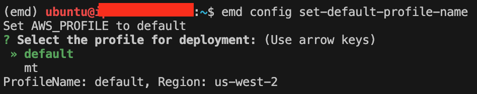
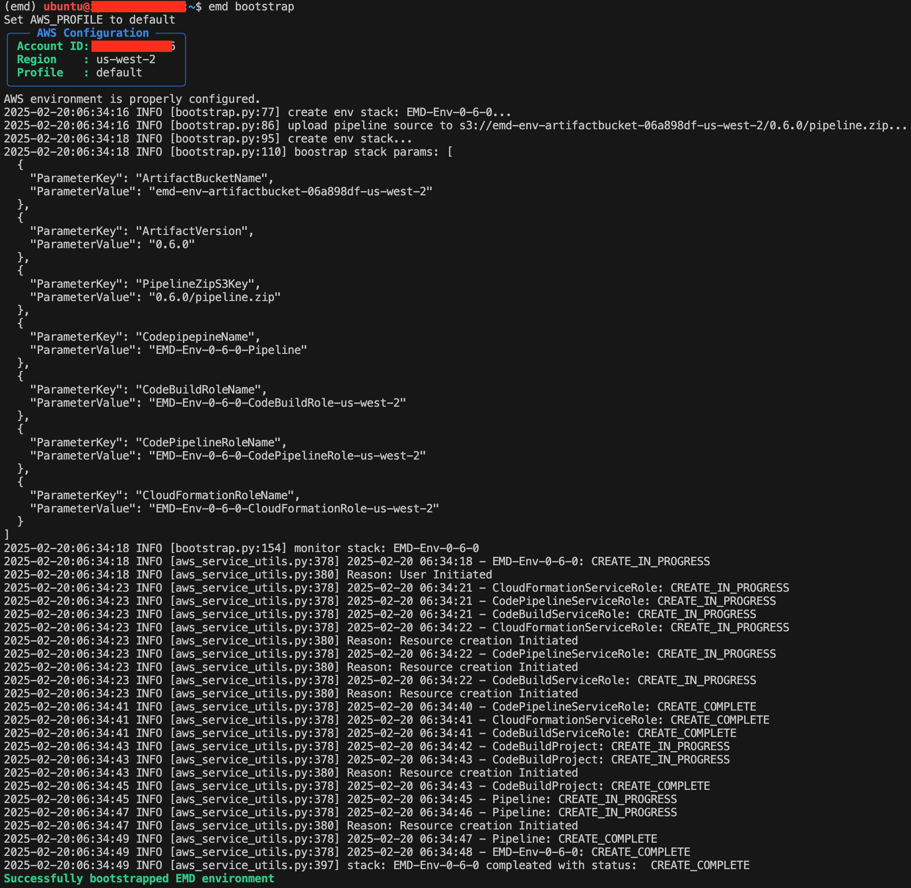
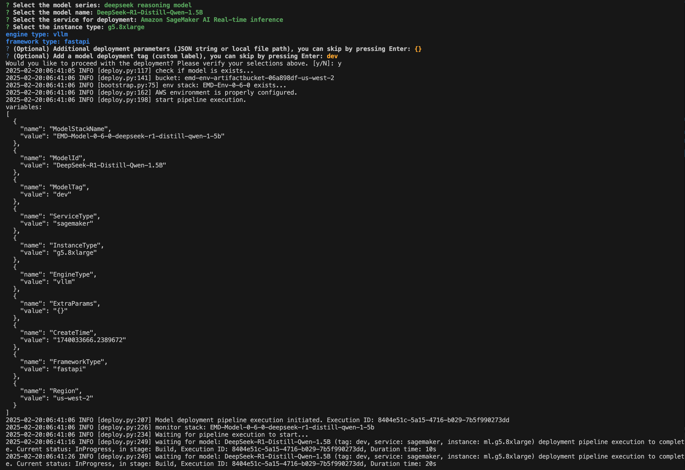
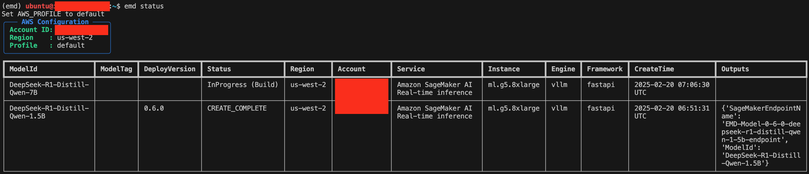
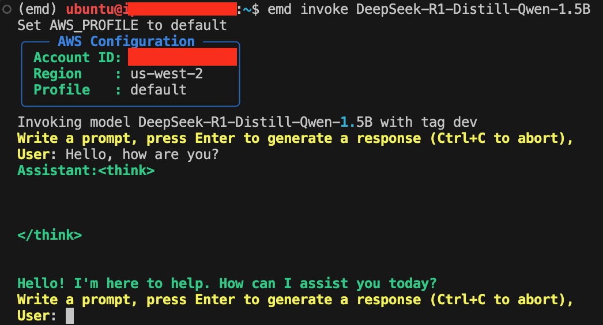
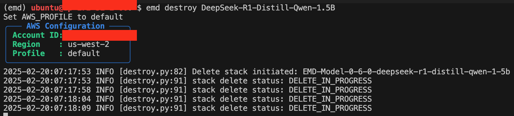

<h3 align="center">
Easy Model Deployer - Simple, Efficient, and Easy-to-Integrate
</h3>

---

*Latest News* 🔥

- [2025/03] We officially released EMD!

---

## About

EMD (Easy Model Deployer) is a lightweight tool designed to simplify model deployment. Built for developers who need reliable and scalable model serving without complex setup.

**Key Features**
- One-click deployment of models to the cloud (Amazon SageMaker, Amazon ECS, Amazon EC2)
- Diverse model types (LLMs, VLMs, Embeddings, Vision, etc.)
- Rich inference engine (vLLM, TGI, Lmdeploy, etc.)
- Different instance types (CPU/GPU/AWS Inferentia)
- Convenient integration (OpenAI Compatible API, LangChain client, etc.)

**Notes**

- OpenAI Compatible API is supported only for Amazon ECS and Amazon EC2 deployment.

## Table of Contents

- [Installation](#installation)
- [Usage](#usage)
- [Documentation](#documentation)
- [Contributing](#contributing)


## Getting Started

### Installation

Install EMD with `pip`, currently only support for Python 3.9 and above:

```bash
pip install https://github.com/aws-samples/easy-model-deployer/releases/download/main/emd-0.6.0-py3-none-any.whl
```

Visit our [documentation](https://aws-samples.github.io/easy-model-deployer/en/installation/) to learn more.

### Usage

#### Choose your default aws profile.
```bash
emd config set-default-profile-name
```
Notes: If you don't set aws profile, it will use the default profile in your env (suitable for Temporary Credentials). Whenever you want to switch deployment accounts, run ```emd config set-default-profile-name```


#### Bootstrap emd stack
```bash
emd bootstrap
```
Notes: This is going to set up the necessary resources for model deployment. Whenever you change EMD version, run this command again.


#### Quickly see what models are supported by ```emd list-supported-models```. This command will output all information related to deployment. The following command is recommended to just check the model type. (Plese check [Supported Models](docs/en/supported_models.md) for complete information.)
```bash
emd list-supported-models | jq -r '.[] | "\(.model_id)\t\(.model_type)"' | column -t -s $'\t' | sort
```

#### Choose deployment parameters interactively by ```emd deploy``` or deploy with one command
```bash
emd deploy --model-id DeepSeek-R1-Distill-Qwen-1.5B --instance-type g5.8xlarge --engine-type vllm --framework-type fastapi --service-type sagemaker --extra-params {} --skip-confirm
```
Notes: Get complete parameters by ```emd deploy --help``` and find the values of the required parameters [here](docs/en/supported_models.md)
When you see "Waiting for model: ...",  it means the deployment task has started, you can quit the current task by ctrl+c.

Notes: For more details about the deployment parameters, please refer to [Deployment parameters](docs/en/deployment.md).

#### Check deployment status.
```bash
emd status
```

Notes: EMD allows to launch multiple deployment tasks at the same time.

#### Quick functional verfication or check our [documentation](https://aws-samples.github.io/easy-model-deployer/) for integration examples.
```bash
emd invoke DeepSeek-R1-Distill-Qwen-1.5B
```
Notes: Find *ModelId* in the output of ```emd status```. Refer to [EMD Client](docs/en/emd_client.md), [Langchain interface](docs/en/langchain_interface.md) and [OpenAI compatible interface](docs/en/openai_compatiable.md) for more details.


#### Delete the deployed model
```bash
emd destroy DeepSeek-R1-Distill-Qwen-1.5B
```
Notes: Find *ModelId* in the output of ```emd status```.



## Documentation

For advanced configurations and detailed guides, visit our [documentation site](https://aws-samples.github.io/easy-model-deployer/).


## Contributing

We welcome contributions! Please see [CONTRIBUTING.md](CONTRIBUTING.md) for guidelines.
