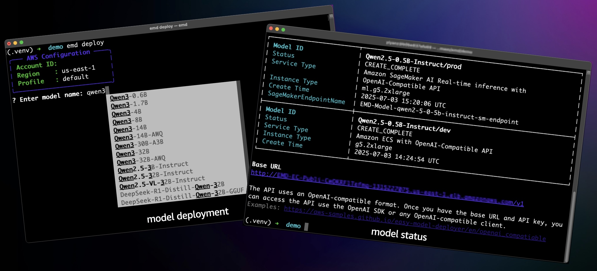

<p align="center">
    <h3 align="center">Easy Model Deployer: Easy Foundation Model Hosting on AWS</h3>
</p>

<p align="center">
  <a href="README.md"><strong>English</strong></a> |
  <a href="README_zh.md"><strong>简体中文</strong></a>
</p>

<p align="center">
  <a href="https://yanbasic.github.io/easy-model-deployer/en/installation"><strong>Documentation</strong></a> ·
  <a href="https://github.com/aws-samples/easy-model-deployer/releases"><strong>Changelog</strong></a>
</p>

<p align="center">
  <a href="https://opensource.org/licenses/MIT"></a>
  <a href="https://pypi.org/project/easy_model_deployer"></a>
  <a href="https://pepy.tech/projects/easy-model-deployer"></a>
  <a href="https://github.com/aws-samples/easy-model-deployer/actions/workflows/release-package.yml"></a>
</p>




## Introduction

Easy Model Deployer is a lightweight tool designed for simplify deploy **Open-Source LLMs** ([Supported Models](https://yanbasic.github.io/easy-model-deployer/en/supported_models)) and Custom Models on AWS. It provides **OpenAI's Completions API** and [**LangChain Interface**](https://github.com/langchain-ai/langchain). Built for developers who need reliable and scalable model serving without complex environment setup.


**Key Features**

- One-click deployment of models to AWS (Amazon SageMaker, Amazon ECS, Amazon EC2)
- Diverse model types (LLMs, VLMs, Embeddings, Vision, etc.)
- Rich inference engine (vLLM, TGI, Lmdeploy, etc.)
- Different instance types (CPU/GPU/AWS Inferentia)
- Convenient integration (OpenAI Compatible API, LangChain client, etc.)

## Supported Models

Easy Model Deployer supports a wide range of models including:

- **LLMs**: Qwen, Llama, DeepSeek, GLM, InternLM, Baichuan, and more
- **Vision-Language Models**: Qwen-VL, InternVL, Gemma3-Vision, and more
- **Embedding Models**: BGE, Jina, BERT-based models
- **Reranking Models**: BGE-Reranker, Jina-Reranker
- **ASR Models**: Whisper variants
- **Custom Models**: Support for custom Docker images

For the complete list of supported models and deployment configurations, see [Supported Models](https://yanbasic.github.io/easy-model-deployer/en/supported_models).

## 🔧 Get Started

### Installation

Install Easy Model Deployer with PyPI, currently support for Python 3.9 or above:

```bash
pip install easy-model-deployer

emd
```

### Bootstrap

Prepare the essential resources required for model deployment.

For more information, please refer to [Architecture](https://yanbasic.github.io/easy-model-deployer/en/architecture/).

```bash
emd bootstrap
```

> **💡 Tip** Once you upgrade the EMD by `pip`, you need to run this command again to update the environment.

### Deploy Models

Deploy models with an interactive CLI or one command line.

```bash
emd deploy
```

> **💡 Tip** To view all available parameters, run `emd deploy --help`.
> When you see the message "Waiting for model: ...", it means the deployment task has started and you can stop the terminal output by pressing `Ctrl+C`.
>
> - For more information on deployment parameters, please refer to the [Deployment parameters](docs/en/installation.md).
> - For best practice examples of using command line parameters, please refer to the [Best Deployment Practices](docs/en/best_deployment_practices.md).

### Show Status

Check the status of the model deployment task.

```bash
emd status
```

> **💡 Tip** The EMD allows launch multiple deployment tasks simultaneously.

### Invocation

Invoke the deployed model for testing by CLI.

```bash
emd invoke <ModelId>
```

> **💡 Tip** You can find the *ModelId* in the output by `emd status`. For example: `emd invoke DeepSeek-R1-Distill-Qwen-1.5B`

- [Integration examples](https://yanbasic.github.io/easy-model-deployer/)
- [EMD client](docs/en/emd_client.md)
- [Langchain interface](docs/en/langchain_interface.md)
- [OpenAI compatible interface](docs/en/openai_compatiable.md).

> **💡 Tip** OpenAI Compatible API is supported only for Amazon ECS and Amazon EC2 deployment types.

### List Supported Models

Quickly see what models are supported, this command will output all information related to deployment. (Please browse [Supported Models](https://yanbasic.github.io/easy-model-deployer/en/supported_models) for more information.)

```bash
emd list-supported-models
```


### Delete Model

Delete the deployed model.

```bash
emd destroy <ModelId>
```

> **💡 Tip** You can find the *ModelId* in the output by `emd status`. For example: `emd destroy DeepSeek-R1-Distill-Qwen-1.5B`

## 📖 Documentation

For advanced configurations and detailed guides, visit our [documentation site](https://yanbasic.github.io/easy-model-deployer/).

## 🤝 Contributing

We welcome contributions! Please see [CONTRIBUTING.md](CONTRIBUTING.md) for guidelines.
