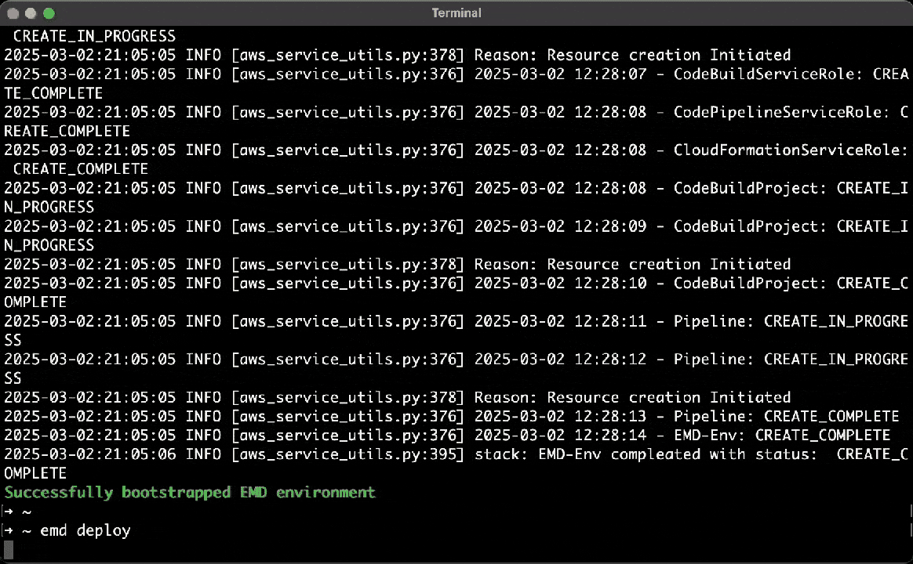

<p align="center">
    <h3 align="center">Easy Model Deployer: Simple, Efficient, and Easy-to-Integrate</h3>
</p>

<p align="center">
  <a href="https://aws-samples.github.io/easy-model-deployer/en/installation"><strong>Documentation</strong></a> ·
  <a href="https://github.com/aws-samples/easy-model-deployer/releases"><strong>Changelog</strong></a>
</p>

<p align="center">
  <a href="https://opensource.org/licenses/MIT"></a>
  <a href="https://pypi.org/project/easy_model_deployer"></a>
  <a href="https://pypi.org/project/easy_model_deployer"></a>
  <a href="https://github.com/aws-samples/easy-model-deployer/actions/workflows/release-package.yml"></a>
</p>

## 🔥 Latest News

- 2025-03-17: Deploy Gemma 3 series models with [one command line](https://github.com/aws-samples/easy-model-deployer/blob/main/docs/en/best_deployment_practices.md##famous-models###gemma-3-series).
- 2025-03-06: Deploy QwQ-32B with [one command line](docs/en/best_deployment_practices.md##famous-models###qwen-series###qwq-32b).

## Introduction

Easy Model Deployer is a lightweight tool designed to simplify the deployment of **Open-Source LLMs** ([Supported Models](docs/en/supported_models.md)) and Custom Models. It provides **OpenAI's Completions API** and [**LangChain Interface**](https://github.com/langchain-ai/langchain). Built for developers who need reliable and scalable model serving without complex setup, it seamlessly integrates with AWS services for efficient model deployment.


**Key Features**

- One-click deployment of models to the cloud (Amazon SageMaker, Amazon ECS, Amazon EC2)
- Diverse model types (LLMs, VLMs, Embeddings, Vision, etc.)
- Rich inference engine (vLLM, TGI, Lmdeploy, etc.)
- Different instance types (CPU/GPU/AWS Inferentia)
- Convenient integration (OpenAI Compatible API, LangChain client, etc.)

## 🚀 Quick Install

Install Easy Model Deployer with `pip`, currently support for Python 3.9 and above:

```bash
pip install easy_model_deployer  # or pip3 install easy_model_deployer
emd
```

Visit our [documentation](https://aws-samples.github.io/easy-model-deployer/en/installation/) to learn more.

## 🔧 Usage

### (Optional) Configure AWS Profile

> If you have already configured your AWS credentials using the AWS CLI, you can skip this step.

You can configure the AWS profile by EMD. If you don't set any AWS profile, the EMD will use the default credentials in your terminal, you can also configure your credentials by [`aws configure`](https://docs.aws.amazon.com/cli/latest/userguide/cli-configure-files.html#cli-configure-files-methods).

```bash
emd config set-default-profile-name
```

### Bootstrap

Prepare the essential resources required for model deployment.

For more information, please refer to [Architecture](https://aws-samples.github.io/easy-model-deployer/en/architecture/).

```bash
emd bootstrap
```

> **💡 Tip** Once you upgrade the EMD by `pip`, you need to run this command again.

### Deploy Model

Deploy models with an interactive CLI or one command.

```bash
emd deploy
```



> **💡 Tip** To view all available parameters, run `emd deploy --help`.
> When you see the message "Waiting for model: ...", it means the deployment task has started and you can stop the terminal output by pressing `Ctrl+C`.
>
> - For more information on deployment parameters, please refer to the [Deployment parameters](docs/en/installation.md).
> - For best practice examples of using command line parameters, please refer to the [Best Deployment Practices](docs/en/best_deployment_practices.md).

### Show Status

Check the status of the model deployment task.

```bash
emd status
```

> **💡 Tip** The EMD allows launch multiple deployment tasks simultaneously.

### Quick Invocation

Invoke the deployed model for testing by CLI.

```bash
emd invoke DeepSeek-R1-Distill-Qwen-1.5B
```

> **💡 Tip** You can find the *ModelId* in the output by `emd status`.

- [Integration examples](https://aws-samples.github.io/easy-model-deployer/)
- [EMD client](docs/en/emd_client.md)
- [Langchain interface](docs/en/langchain_interface.md)
- [OpenAI compatible interface](docs/en/openai_compatiable.md).

> **💡 Tip** OpenAI Compatible API is supported only for Amazon ECS and Amazon EC2 deployment types.

### List Supported Models

Quickly see what models are supported, this command will output all information related to deployment. (Plese browse [Supported Models](docs/en/supported_models.md) for more information.)

```bash
emd list-supported-models
```

The following command is recommended to just list the model types.

```bash
emd list-supported-models | jq -r '.[] | "\(.model_id)\t\(.model_type)"' | column -t -s $'\t' | sort
```

### Delete Model

Delete the deployed model.

```bash
emd destroy DeepSeek-R1-Distill-Qwen-1.5B
```

> **💡 Tip** You can find the *ModelId* in the output by `emd status`.

## 📖 Documentation

For advanced configurations and detailed guides, visit our [documentation site](https://aws-samples.github.io/easy-model-deployer/).

## 🤝 Contributing

We welcome contributions! Please see [CONTRIBUTING.md](CONTRIBUTING.md) for guidelines.
