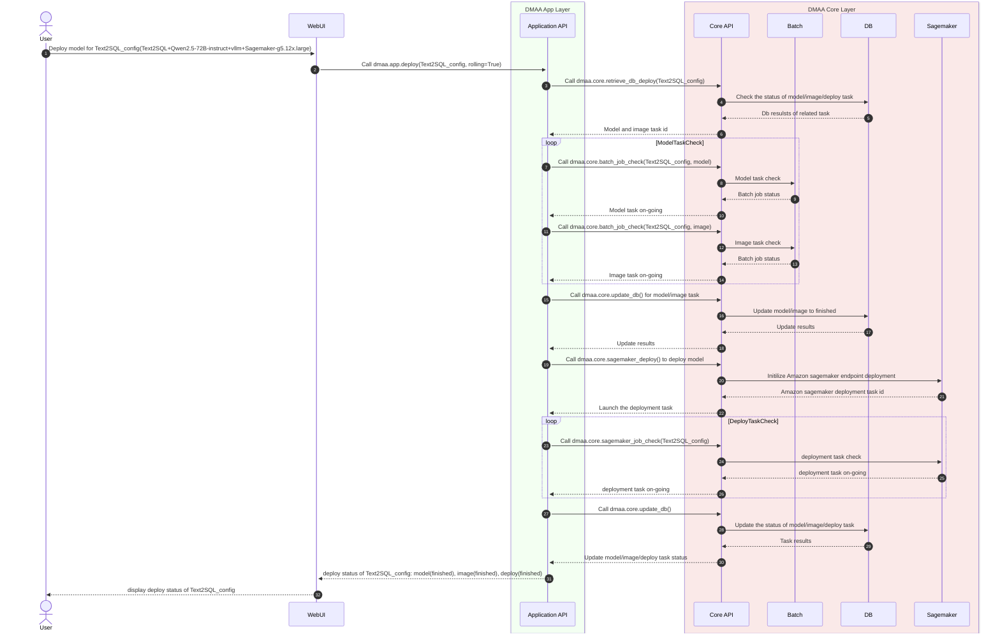

<!-- to preview the time sequence diagram, use mermaid or install mermaid extension in vscode -->
<!-- to export, install mermaid cli: yarn global add @mermaid-js/mermaid-cli
mmdc -s 2 -i <file path> -e png -->
# Time sequence diagram of deploy a model in rolling mode

